# Computer Network

 Computer Networking is the practice of connecting computers together to enable communication and data exchange between them.

``Basic Terminologies of Computer Networks``

- Network: A network is a collection of computers and devices that are connected together to enable communication and data exchange.

- Nodes: Nodes are devices that are connected to a network. eg..,Printers, Routers, Switches.

- Protocol: A protocol is a set of rules and standards that govern how data is transmitted over a network. 

- Topology: Network topology refers to the physical and logical arrangement of nodes on a network.

- IP Address: An IP address is a unique numerical identifier that is assigned to every device on a network.

- DNS: The Domain Name System (DNS) is a protocol that is used to translate human-readable domain names (such as www.google.com) into IP addresses that computers can understand

- Firewall: A firewall is a security device that is used to monitor and control incoming and outgoing network traffic

- Hostname: Each device in the network is associated with a unique device name known as Hostname

- MAC Address (Media Access Control address): Also known as physical address, the MAC Address is the unique identifier of each host and is associated with its 

- Port: A port can be referred to as a logical channel through which data can be sent/received to an application. A port number is a 16-bit integer, hence, we have 216 ports available

- Socket: The unique combination of IP address and Port number together is termed a Socket. 

- DNS Server: DNS stands for Domain Name System. DNS is basically a server that translates web addresses or URLs (ex: www.google.com) into their corresponding IP addresses.

- ARP: ARP stands for Address Resolution Protocol. It is used to convert an IP address to its corresponding physical address(i.e., MAC Address). ARP is used by the Data Link Layer to identify the MAC address of the Receiver’s machine. 

- Collision Domain : A Collision Domain is a scenario in which when a device sends out a message to the network, all other devices which are included in its collision domain have to pay attention to it, no matter if it was destined for them or not. This causes a problem because, in a situation where two devices send out their messages simultaneously, a collision will occur leading them to wait and re-transmit their respective messages, one at a time. Remember, it happens only in the case of a half-duplex mode.

- Broadcast Domain : A Broadcast Domain is a scenario in which when a device sends out a broadcast message, all the devices present in its broadcast domain have to pay attention to it. This creates a lot of congestion in the network, commonly called LAN congestion, which affects the bandwidth of the users present in that network. 

- HUB : A network hub is a node that broadcasts data to every computer connected to it.It is used to connect multiple devices in a network.

- a **switch** connects multiple devices to create a network, a **router** connects multiple switches, and their respective networks, to form an even larger network

**Types of Computer Network Architecture**

- Client-Server Architecture:Nodes can be Servers or Clients. Here, the server node can manage the Client Node Behaviour.

- Peer-to-Peer Architecture: Each device is free for working as either client or server.

**Types of Network Topology**

**Mesh Topology**

Every device is connected to another via dedicated channels

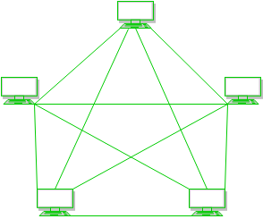

**Star Topology**

All the devices are connected to a single hub through a cable.


**Bus Topology**

Every computer and network device is connected to a single cable. It is bi-directional. It is a multi-point connection and a non-robust topology because if the backbone fails the topology crashes.

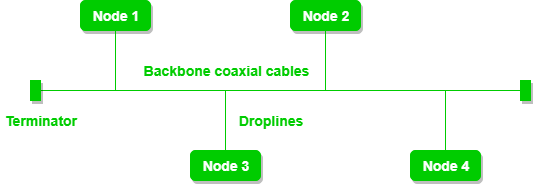


**Ring Topology**

It forms a ring connecting devices with exactly two neighboring devices


**Tree Topology**

It has a hierarchical flow of data.

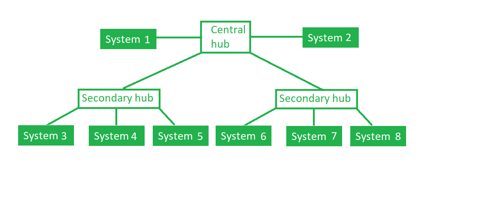

**Hybrid Topology**

This topological technology is the combination of all the various types of topologie

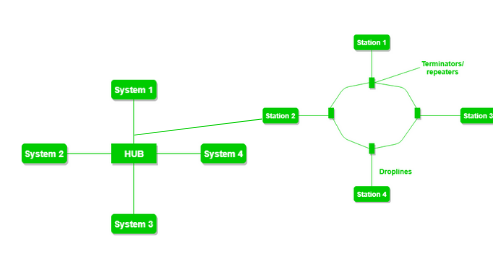


## OSI Model

- OSI stands for Open System Interconnection is a reference model that describes how information from a software application in one computer moves through a physical medium to the software application in another computer.

- OSI consists of seven layers, and each layer performs a particular network function.

**What are the 7 layers of the OSI Model?**

**Physical Layer – Layer 1**

- it is responsible for the actual physical connection between the devices.

- The physical layer contains information in the form of bits. It is responsible for transmitting individual bits from one node to the next.

**Functions of the Physical Layer**

- Bit synchronization: The physical layer provides the synchronization of the bits by providing a clock. This clock controls both sender and receiver thus providing synchronization at the bit level.

- Bit rate control: The Physical layer also defines the transmission rate i.e. the number of bits sent per second.

- Physical topologies: Physical layer specifies how the different, devices/nodes are arranged in a network i.e. bus, star, or mesh topology.

- Transmission mode: Physical layer also defines how the data flows between the two connected devices. The various transmission modes possible are Simplex, half-duplex and full-duplex.

```
Hub, Repeater, Modem, and Cables are Physical Layer devices. 
Network Layer, Data Link Layer, and Physical Layer are also known as Lower Layers or Hardware Layers.
```

**Data Link Layer (DLL) – Layer 2**

- It defines the format of the data on the network.

- It is mainly responsible for the unique identification of each device that resides on a local network.

It contains two sub-layers:

Logical Link Control Layer

- It is responsible for transferring the packets to the Network layer of the receiver that is receiving.

- It identifies the address of the network layer protocol from the header.

- It also provides flow control.

Media Access Control Layer

- A Media access control layer is a link between the Logical Link Control layer and the network's physical layer.

- It is used for transferring the packets over the network.

**Functions of the Data Link Layer**

- Framing: The data link layer translates the physical's raw bit stream into packets known as Frames

- Physical Addressing: The Data link layer adds a header to the frame that contains a destination address. The frame is transmitted to the destination address mentioned in the header.

- Flow Control: It is the technique through which the constant data rate is maintained on both the sides so that no data get corrupted.

- Access Control: When two or more devices are connected to the same communication channel, then the data link layer protocols are used to determine which device has control over the link at a given time.

- Error Control: it provides the mechanism of error control in which it detects and retransmits damaged or lost frames.

```Switch & Bridge are Data Link Layer devices.```

### Error Detection and Recovery

Error is a condition when the receiver’s information does not match the sender’s information.

**Types of Errors**

**Single-Bit Error**

- It occurs when one bit (i.e., a single binary digit) of a transmitted data unit is altered during transmission, resulting in an incorrect or corrupted data unit.

**Burst Error**

- When several consecutive bits are flipped mistakenly in digital transmission, it creates a burst error. This error causes a sequence of consecutive incorrect values.

**Error Detection Methods**

Simple Parity Check

Simple-bit parity is a simple error detection method that involves adding an extra bit to a data transmission. It works as:

- 1 is added to the block if it contains an odd number of 1’s, and

- 0 is added if it contains an even number of 1’s

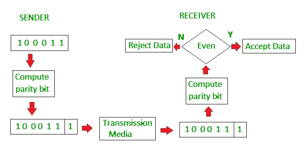


Disadvantages

- Single Parity check is not able to detect even no. of bit error. 

**Checksum**

Checksum – Operation at Sender’s Side

- Firstly, the data is divided into k segments each of m bits.

- On the sender’s end, the segments are added using 1’s complement arithmetic to get the sum. The sum is complemented to get the checksum.

- The checksum segment is sent along with the data segments.

Checksum – Operation at Receiver’s Side

- At the receiver’s end, all received segments are added using 1’s complement arithmetic to get the sum. The sum is complemented.

- If the result is zero, the received data is accepted; otherwise discarded

Disadvantages

- If one or more bits of a segment are damaged and the corresponding bit or bits of opposite value in a second segment are also damaged.


**Cyclic Redundancy Check (CRC)**

- CRC is based on binary division.

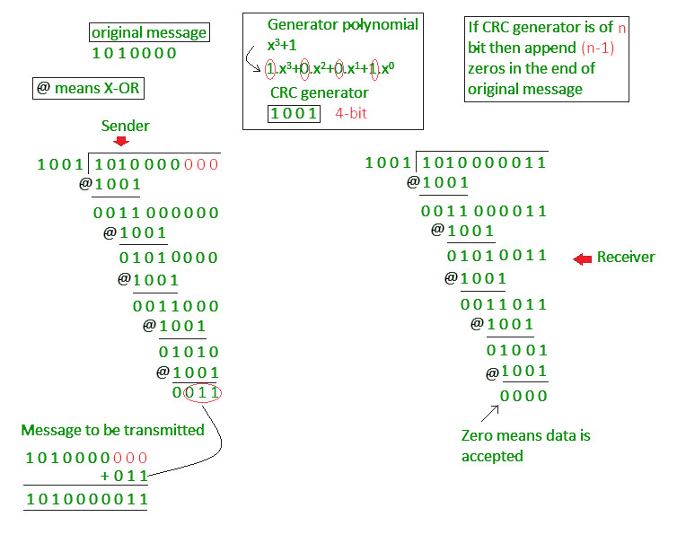

**Hamming code**

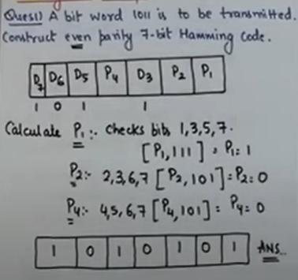
**Network Layer – Layer 3**

- It determines the best path to move data from source to the destination based on the network conditions, the priority of service, and other factors.

**Functions of Network Layer:**

- Routing: The network layer protocols determine which route is suitable from source to destination.

- Logical Addressing : The sender & receiver’s IP addresses are placed in the header by the network layer. Such an address distinguishes each device uniquely and universally.

**Transport Layer**

- It ensures that messages are transmitted in the order in which they are sent and there is no duplication of data.

- It receives the data from the upper layer and converts them into smaller units known as segments.

- It is responsible for the End to End Delivery of the complete message.

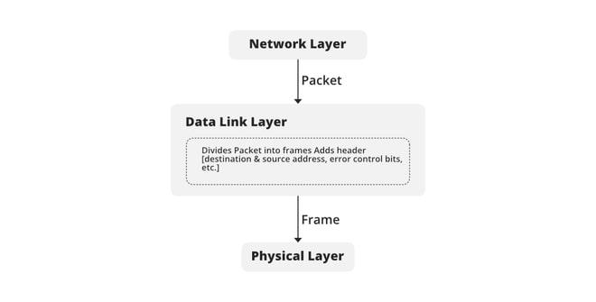

**Functions of the Transport Layer**

- Segmentation and Reassembly : When the transport layer receives the message from the upper layer, it divides the message into multiple segments, and each segment is assigned with a sequence number that uniquely identifies each segment. When the message has arrived at the destination, then the transport layer reassembles the message based on their sequence numbers

- Service Point Addressing: To deliver the message to the correct process, the transport layer header includes a type of address called service point address or port address. Thus by specifying this address, the transport layer makes sure that the message is delivered to the correct process.

**Session Layer – Layer 5**

This layer is responsible for the establishment of connection, maintenance of sessions, and authentication, and also ensures security.

**Functions of the Session Layer**

- Synchronization: Session layer adds some checkpoints when transmitting the data in a sequence. If some error occurs in the middle of the transmission of data, then the transmission will take place again from the checkpoint. This process is known as Synchronization and recovery.

- Dialog Controller: The session layer allows two systems to start communication with each other in half-duplex or full-duplex.

**Presentation Layer – Layer 6**

- It acts as a data translator for a network.

- it  converts the data from one presentation format to another format.

**Functions of Presentation layer:**

- Translation: For example, ASCII to EBCDIC.

- Encryption/ Decryption

- Compression: Reduces the number of bits that need to be transmitted on the network.

**Application Layer – Layer 7**

- This layer provides the network services to the end-users.

- It serves as a window for users and application processes to access network service.

**Functions of the Application Layer**

- FTAM- File transfer access and management : This application allows a user to access file in a remote host, retrieve files in remote host and manage or control files from a remote computer.

- Mail Services : Provide email service.

- Directory Services


## TCP/IP Reference model


**OSI-VS-TCP/IP**


**Multiple Access Control** 

If there is a dedicated link between the sender and the receiver then data link control layer is sufficient, however if there is no dedicated link present then multiple stations can access the channel simultaneously.

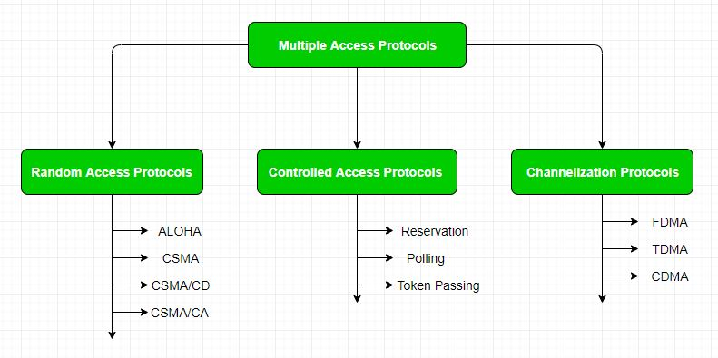

**Random Access Protocol**

- all the station has the equal priority to send the data over a channel.

- Any station can send data depending on medium’s state( idle or busy).

- There is no fixed sequence of stations sending data

- if more than one station sends the data over a channel, there may be a collision or data conflict. Due to the collision, the data frame packets may be lost or changed

The Random access protocols are further subdivided as: 

1. **ALOHA**

multiple stations can transmit data at the same time and can hence lead to collision and data being garbled. 

- **Pure Aloha**

When a station sends data it waits for an acknowledgement. If the acknowledgement doesn’t come within the allotted time then the station waits for a random amount of time called back-off time (Tb) and re-sends the data. Since different stations wait for different amount of time, the probability of further collision decreases. 

```Vulnerable Time = 2* Frame transmission time
Throughput =  G exp{-2*G}
Maximum throughput = 0.184 for G=0.5
```

- **Slotted Aloha**

It is similar to pure aloha, except that we divide time into slots and sending of data is allowed only at the beginning of these slots. If a station misses out the allowed time, it must wait for the next slot. This reduces the probability of collision. 

```
Vulnerable Time =  Frame transmission time
Throughput =  G exp{-*G}
Maximum throughput = 0.368 for G=1
```

2. **CSMA – Carrier Sense Multiple Access**

- the station is required to first sense the medium (for idle or busy) before transmitting data. If it is idle then it sends data, otherwise it waits till the channel becomes idle. 

- However there is still chance of collision in CSMA due to propagation delay.

**CSMA access modes-**

- 1-persistent: The node senses the channel, if idle it sends the data, otherwise it continuously keeps on checking the medium for being idle and transmits unconditionally(with 1 probability) as soon as the channel gets idle.

- Non-Persistent: The node senses the channel, if idle it sends the data, otherwise it checks the medium after a random amount of time (not continuously) and transmits when found idle. 

- P-persistent: The node senses the medium, if idle it sends the data with p probability. If the data is not transmitted ((1-p) probability) then it waits for some time and checks the medium again, now if it is found idle then it send with p probability. This repeat continues until the frame is sent. It is used in Wifi and packet radio systems. 

- O-persistent: Superiority of nodes is decided beforehand and transmission occurs in that order. If the medium is idle, node waits for its time slot to send data.

3. **CSMA/ CD**

- It first senses the shared channel before broadcasting the frames, and if the channel is idle, it transmits a frame to check whether the transmission was successful. If the frame is successfully received, the station sends another frame. If any collision is detected in the CSMA/CD, the station sends a jam/ stop signal to the shared channel to terminate data transmission. After that, it waits for a random time before sending a frame to a channel.

**CSMA/ CA**

When a data frame is sent to a channel, it receives an acknowledgment to check whether the channel is clear. If the station receives only a single (own) acknowledgments, that means the data frame has been successfully transmitted to the receiver. But if it gets two signals (its own and one more in which the collision of frames), a collision of the frame occurs in the shared channel. Detects the collision of the frame when a sender receives an acknowledgment signal.

CSMA/CA avoids collision by: 

- Interframe space – Station waits for medium to become idle and if found idle it does not immediately send data (to avoid collision due to propagation delay) rather it waits for a period of time called Interframe space or IFS. After this time it again checks the medium for being idle. 

-  Contention window: the total time is divided into different slots. When the station/ sender is ready to transmit the data frame, it chooses a random slot number of slots as wait time. If the channel is still busy, it does not restart the entire process, except that it restarts the timer only to send data packets when the channel is inactive.

- Acknowledgement – The sender re-transmits the data if acknowledgement is not received before time-out.

**Channelization**

- **Frequency Division Multiple Access (FDMA)** – The available bandwidth is divided into equal bands so that each station can be allocated its own band. Guard bands are also added so that no two bands overlap to avoid crosstalk and noise. 

- **Time Division Multiple Access (TDMA)** – In this, the bandwidth is shared between multiple stations. To avoid collision time is divided into slots and stations are allotted these slots to transmit data. However there is a overhead of synchronization as each station needs to know its time slot. This is resolved by adding synchronization bits to each slot. Another issue with TDMA is propagation delay which is resolved by addition of guard bands. 

- **Code Division Multiple Access (CDMA)** – One channel carries all transmissions simultaneously. There is neither division of bandwidth nor division of time. 


**Controlled Access Protocols**

**Reservation**

- In the reservation method, a station needs to make a reservation before sending data

- If there are M stations, the reservation interval is divided into M slots, and each station has one slot.

- The stations which have reserved their slots transfer their frames in that order.

- After data transmission period, next reservation interval begins.

- Since everyone agrees on who goes next, there will never be any collisions.

**Polling**

- In this, one acts as a primary station(controller) and the others are secondary stations. All data exchanges must be made through the controller.

- The message sent by the controller contains the address of the node being selected for granting access.

- Although all nodes receive the message the addressed one responds to it and sends data if any. If there is no data, usually a “poll reject”(NAK) message is sent back.

``` Efficiency = Tt/(Tt + Tpoll)
where Tpoll be the time for polling and Tt be the time for transmission of data.
```

**Token Passing**

- In token passing scheme, the stations are connected logically to each other in form of ring and access to stations is governed by tokens.

- A token is a special bit pattern or a small message, which circulate from one station to the next in some predefined order.

- when a node receive a token,it hold onto the token only if it has some frames to transmit; otherwise it immediately forward the token to the next node.

-  if a node have frames to transmit when it receive the token,it sends up to a maximum number of frames and then forward the token to the next node.

- There exists problems like duplication of token or token is lost or insertion of new station, removal of a station, which need be tackled for correct and reliable operation of this scheme

```
The average time (delay) required to send a token to the next station = a/N.
Throughput, S = 1/(1 + a/N) for a<1 
S = 1/{a(1 + 1/N)} for a>1.  
       where N = number of stations
             a = Tp/Tt 
(Tp = propagation delay and Tt = transmission delay)
```

**Piggybacking**

Piggybacking is a process of attaching acknowledgment with the data packet to be sent. 

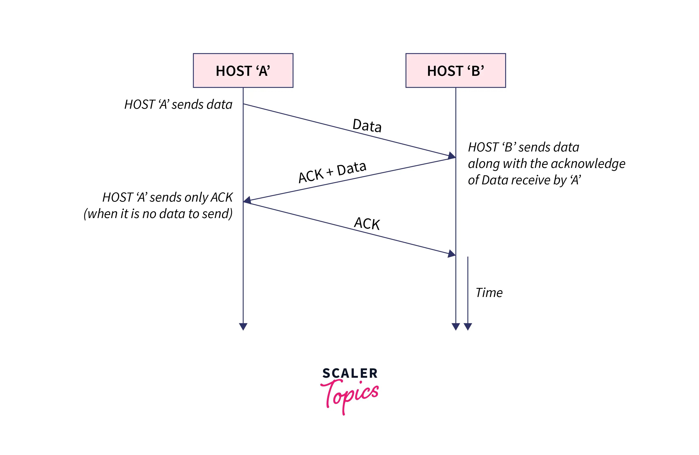


## Flow Control

Flow control is a technique that allows two stations working at different speeds to communicate with each other

## Flow conrtrol Protocol

``` A protocol refers to a defined set of guidelines and regulations that control the communication between different devices in a network.```
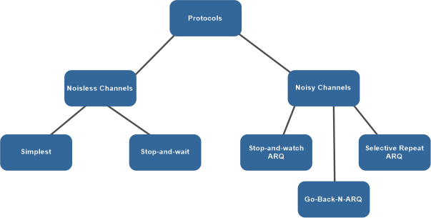

### Stop And Wait Protocol

- It is data link layer protocol for transmmision of frames over noiseless channels.

**Flow Diagram**

Sender side
- Rule 1:Send one data packet at a time
- Rule 2:SEnd the next packet only after receiving Acknowledge for the previous

Receiver side
- Rule 1:Receive and consume data packet
- Rule 2:After consuming packet,ACK need to be sent(Flow Control)

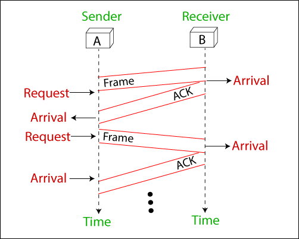

**Problem Of Stop And Wait Protocol**

- Problem due to lost of data
1. sneder waits for ack for an infinite time
2. Receiver waits for data an infinite time
-  Problems due to lost Ack
- problem due to delayed ACK/data.

### Stop And Wait ARQ Protocol

- if the acknowledgement does not arive after a certain period of time,the sender time out and retransmit the original frame.
- Stop and Wait ARQ= stop and wait + Timeout Timer + Sequence number

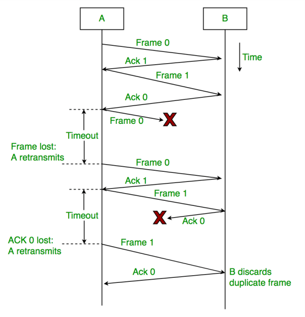

### Go-Back-N ARQ
- Go-Back-N ARQ uses the concept of protocol pipeline i.e the sender can send multiple frames before receiving the acknowledment for the first frame.
- There are finite number of frames and the frames are numbered in a sequential manner.
- The number of frames that can be dent depends on the window size of the sender.
- If the acknowledgment of a frame is not received within an agreed upon time period, all frames in the current window are transmitted.
- The size of the sending window determines the sequence number of the outbound frames.
-In Go-Back-N, N determines the sender's window size, and the size of the receiver's window is always 1.

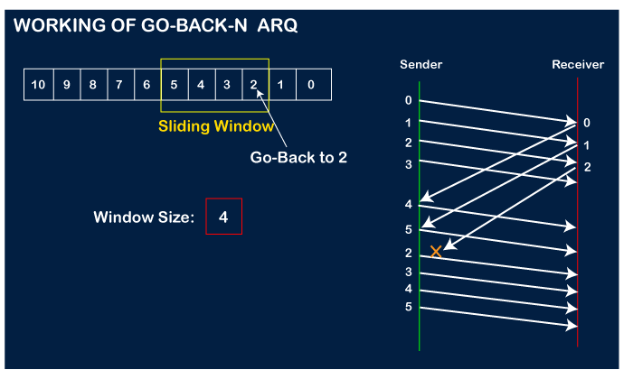

### Selective Repeat ARQ
- In selective repeat ARQ, only the lost frame are retransmitted while correct frames are received and buffered.
- The receiver while keeping track of sequence numbers,buffer the frames in memory and sends Negative ACK for only frame which is missing or damaged.
- The sender will send/transmit packet for which Negative Packet is received.

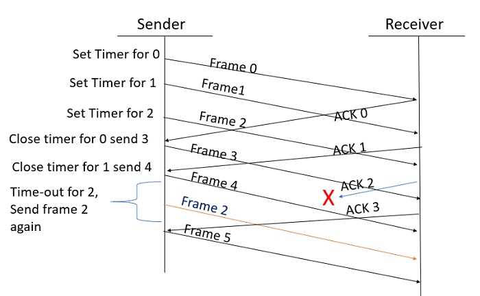

## IP Address (IPV4)
- Every node in computer network is defined with the help of IP address.
- logical address
- Can change based on the location of the device
- Assigned by manually or dynamically
- Represented in decimal and it has $ octets(x.x.x.x).
- 0.0.0.0 to 255.255.255.255(32bits).

## IPv4 Datagram Header

.png)


### Distance Vector Algorithm 

- A router transmits its distance vector to each of its neighbors in a routing packet.
- Each router receives and saves the most recently received distance vector from each of its neighbors.
- A router recalculates its distance vector when:
It receives a distance vector from a neighbor containing different information than before.
- It discovers that a link to a neighbor has gone down.

The DV calculation is based on minimizing the cost to each destination

### Link State Routing
Link state routing is a technique in which each router shares the knowledge of its neighborhood with every other router in the internetwork.

- **Knowledge about the neighborhood**: Instead of sending its routing table, a router sends the information about its neighborhood only. A router broadcast its identities and cost of the directly attached links to other routers.
- **Flooding**: Each router sends the information to every other router on the internetwork except its neighbors. This process is known as Flooding. Every router that receives the packet sends the copies to all its neighbors. Finally, each and every router receives a copy of the same information.
- **Information sharing**: A router sends the information to every other router only when the change occurs in the information.

Note:
```Each node uses Dijkstra's algorithm on the graph to calculate the optimal routes to all nodes.```

## Internet Control Message Protocol (ICMP)

- Internet Control Message Protocol (ICMP) is a network layer protocol used to diagnose communication errors by performing an error control mechanism.

- Since IP does not have an inbuilt mechanism for sending error and control messages. It depends on Internet Control Message Protocol(ICMP) to provide error control for reporting errors and management queries

- ICMP is a connectionless protocol.ICMP packets are transmitted in the form of datagrams that contain an IP header with ICMP data. 

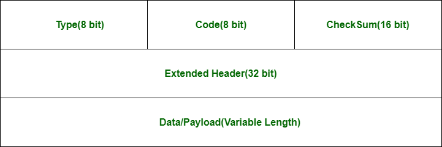

##  IGMP(Internet Group Management Protocol)

- IGMP is a communication protocol used by hosts and adjacent routers for multicasting communication with IP networks and uses the resources efficiently to transmit the message/data packets.

- The IGMP message is encapsulated within an IP datagram.

```
The IP protocol supports two types of communication:
Unicasting- It is a communication between one sender and one receiver. Therefore, we can say that it is one-to-one communication.
Multicasting: Sometimes the sender wants to send the same message to a large of receivers simultaneously. This process is known as multicasting which has one-to-many communication.
```
v
## IPv4 to IPv6 transition 
**is required:**

- IPv6 reduces the size of routing tables and makes routing more efficient.
- IPv6 supports multicast more than broadcast.
- Address auto-configuration (address assignment) is built in to IPv6.
- IPsec, which provides privacy, authenticity and data compatibility, is wired into in IPv6.

### Various techniques used in transition:
**Dual Stack:**
- Dual Stack is the technique to allow an IPv4 and IPv6 address to be defined on the same network interface.

**Tunnelling:**
- The IPv4 networks can communicate with the transit or intermediate network on IPv6 with the help of the Tunnel.IPv6 Packet is encapsulated in an IPv$ Region.

**IPv6 translation:**

- IPv6 translation schemes implement some form of packet-header translations between the IPv6 and IPv4 addresses.
- The goal is to translate packets with IPv6 addresses to those with IPv4 addresses, so that IPv6-only hosts can talk to the IPv4-only Internet.

## Network Classes

The first step in planning for IP addressing on your network is to determine which network class is appropriate for your network. 

### Class A Network Numbers
A class A network number uses the first eight bits of the IP address as its "network part." The remaining 24 bits comprise the host part of the IP address

### Class B Network Numbers
A class B network number uses 16 bits for the network number and 16 bits for host numbers. 
Class B is typically assigned to organizations with many hosts on their networks.

### Class C Network Numbers
Class C network numbers use 24 bits for the network number and 8 bits for host numbers. Class C network numbers are appropriate for networks with few hosts--the maximum being 254. A class C network number occupies the first three bytes of an IP address. Only the fourth byte is assigned at the discretion of the network owners

.png>)

## Difference between Static and Dynamic Routing

.png>)

## Shortest Path Routing Algorithm

**Dijkstra’s Algorithm**

For each node v which is adjacent to u, update dist[v] as −

- If (dist[u] + weight of edge u-v) < dist[v], Then

-Update dist[v] = dist[u] + weight of edge u-v


**Bellman Ford Algorithm**

- Initialize distances from s to all nodes as infinite (∞); distance to itself as 0;

- Calculate the shortest distances iteratively. Repeat |V|- 1 times for each node except s −

- Repeat for each edge connecting vertices u and v −

- If dist[v] > (dist[u] + weight of edge u-v), Then

- Update dist[v] = dist[u] + weight of edge u-v

## Routing Information Protocol (RIP) V1 & V2

- Routing Information Protocol  are the intradomain (interior) routing protocol 

- it is based on distance vector routing and it is used inside an autonomous system.

- Routers and network links are called node

- The first column of routing table is destination address.

- The cost of metric in this protocol is hop count which is number of networks which need to be passed to reach destination. 

- Here infinity is defined by a fixed number which is 16 it means that using a Rip, network cannot have more than 15 hops.


